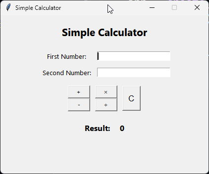

# 🧮 Python Simple Calculator

A desktop calculator built with **Python** and **Tkinter** to practice core programming concepts, modular application design, and GUI development.

The project began as a **terminal-based calculator (v1.0)** and was later redesigned into a **desktop GUI application (v2.0)** while preserving clean project architecture and reusable business logic.


---

## ✨ Features

### GUI Calculator (v2.0)

- ➕ Addition
- ➖ Subtraction
- ✖️ Multiplication
- ➗ Division
- 🖥️ Desktop GUI built with Tkinter
- ✅ Input validation
- ⚠️ Error dialogs using MessageBox
- 🧹 Clear button
- 🎯 Automatic focus management
- 🔄 Dynamic result updates
- 🧩 Modular architecture

---

## 🛠 Technologies Used

- Python 3
- Tkinter

---

## 📚 Concepts Practiced

- Functions
- Modules & Packages
- Higher-order Functions
- Event-driven Programming
- Lambda Functions
- Exception Handling
- Input Validation
- Tkinter GUI Development
- Layout Management (`pack()` & `grid()`)
- Message Boxes
- Modular Programming
- Git & GitHub Workflow

---

## ▶️ Running the Application

Clone the repository

```bash
git clone https://github.com/AradhyaMaheshwari-bit/python-simple-calculator.git
```

Navigate to the project directory

```bash
cd python-simple-calculator
```

Run the application

```bash
python main.py
```

---

## 📂 Project Structure

```text
python-simple-calculator/
├── modules/
│   └── operations.py
├── utils/
│   └── validate.py
├── app.py
├── main.py
├── README.md
└── .gitignore
```

---

## 🚀 Version History

### v1.0-terminal

- Terminal-based calculator
- Menu-driven interface
- Modular architecture
- Input validation
- Exception handling

### v2.0-gui

- Tkinter desktop application
- Modern GUI
- Error dialogs
- Clear button
- Improved user experience
- Refactored application entry point

---

## 🔮 Planned Features (v3.0)

- Calculator-style interface
- Keyboard-only operation
- Numpad support
- Scientific operations
- Expression evaluation
- Calculation history
- Light/Dark theme

---

## 📸 Screenshot



---

## 🎯 Learning Outcomes

This project helped me understand:

- Designing modular Python applications
- Separating business logic from the user interface
- Building event-driven desktop applications
- Creating reusable callback functions
- Handling exceptions gracefully in GUI applications
- Maintaining meaningful Git history through incremental development

---

## 👨‍💻 Author

**Aradhya Maheshwari**
