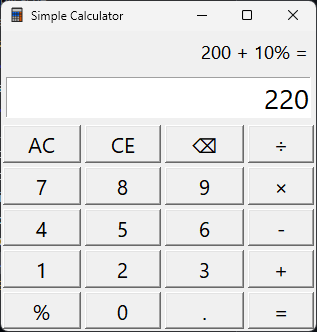

# 🧮 Python Simple Calculator

A desktop calculator built with **Python** and **Tkinter** to practice software design, event-driven programming, GUI development, and incremental software architecture.

The project began as a **terminal-based calculator (v1.0)**, evolved into a **Tkinter desktop application (v2.0)**, introduced a dedicated **calculator engine with state management (v3.0)**, adopted a **data-driven GUI architecture (v3.1)**, added **keyboard support and calculator usability improvements (v3.2)**, and was finally refactored into a clean **object-oriented GUI architecture (v4.0)** with improved separation of responsibilities and maintainability.


---

## ✨ Features

### Core Operations

- ➕ Addition
- ➖ Subtraction
- ✖️ Multiplication
- ➗ Division
- 🔄 Sequential calculations
- 🔁 Repeated equals (`=`)
- 🔄 Operator replacement

### Input & Editing

- 🔢 Calculator-style digit input
- 🔢 Decimal number support
- 🚫 Prevents multiple decimal points
- ⌫ Backspace support
- 🧹 All Clear (AC)
- 🧹 Clear Entry (CE)

### Display & Error Handling

- 📄 Live expression display
- 🎯 Automatic input state management
- ✨ Clean result formatting (e.g. `12` instead of `12.0`)
- ⚠️ Division-by-zero handling
- 🔁 Error recovery

### User Experience

- ⌨️ Keyboard shortcuts
- ⌨️ Numpad support
- 🪟 Custom application window icon
- 🔠 Responsive font scaling

### Architecture

- 🧱 Object-oriented GUI architecture
- 🧩 Modular architecture
- ⚙️ Data-driven button generation
- 🏷️ Button metadata for scalable GUI behavior
- 🖥️ Desktop GUI built with Tkinter

---

## 🛠 Technologies Used

- Python 3.14
- Tkinter
- Git & GitHub

---

## 📚 Concepts Practiced

### Software Design

- Object-Oriented Design (Calculator Engine)
- Object-Oriented GUI Design
- Class-based GUI Architecture
- Modular Programming
- Separation of Concerns
- State Management
- State Machine Design

### GUI Development

- Tkinter GUI Development
- Event-driven Programming
- Callback Functions
- Keyboard Event Handling
- Layout Management (`pack()` & `grid()`)
- GUI Refactoring
- GUI Metadata Configuration

### Python Concepts

- Lambda Functions & Closures
- Exception Handling
- Helper Functions
- Data-driven Programming
- Dictionary-based Configuration
- Dictionary Dispatch Pattern

### Development Workflow

- Git & GitHub Workflow
- UI/UX Polish

---

## ▶️ Running the Application

Clone the repository

```bash
git clone https://github.com/AradhyaMaheshwari-bit/python-simple-calculator.git
```

Navigate to the project directory

```bash
cd python-simple-calculator
```

Run the application

```bash
python main.py
```

---

## 📂 Project Structure

```text
python-simple-calculator/
├── assets/
│   ├── icon.ico
│   └── screenshot.png
├── modules/
│   ├── calculator.py
│   └── operations.py
├── app.py
├── main.py
├── README.md
└── .gitignore
```

---

## 🚀 Version History

### v1.0 — Terminal Calculator

- Menu-driven calculator
- Input validation
- Modular arithmetic functions
- Exception handling

### v2.0 — Desktop GUI

- Tkinter interface
- Calculator buttons
- Event-driven callbacks
- Clear button
- Improved project structure

### v3.0 — Calculator Engine

- Calculator input state management
- Sequential calculations
- Calculation engine
- Repeated operator handling
- Division-by-zero recovery
- Expression display
- Display formatting
- Backspace support
- Improved modular architecture

### v3.1 — Data-Driven GUI Refactoring

- Centralized display updates
- Centralized error handling
- Dynamic button generation
- Data-driven button configuration
- Button metadata (`type`)
- Reduced duplicated GUI code
- Improved callback organization
- Cleaner and more maintainable architecture

### v3.2 — Keyboard Support & Calculator UX

- Keyboard shortcuts
- Numpad support
- Repeated equals (`=`)
- Clear Entry (CE)
- Operator replacement
- Custom window icon
- Improved expression alignment
- Improved button layout
- Dictionary-based operation dispatch
- Additional UI polish

### v4.0 — Object-Oriented GUI Architecture

- Converted the GUI into a CalculatorApp class
- Introduced application lifecycle through __init__() and run()
- Extracted window, display, and button creation into dedicated methods
- Reorganized GUI callbacks into class methods
- Centralized keyboard command handling
- Improved button metadata using clear modes
- Refined naming and project organization
- Improved maintainability while preserving calculator behavior

---

## 📸 Screenshot



---

## 🔮 Roadmap

### v5.0 — Expression Parser

- Replace immediate evaluation with full expression evaluation
- Expression tokenizer
- Expression parser
- Expression evaluator
- BODMAS / operator precedence
- Parentheses support

### v5.1 — Scientific Calculator

- Scientific functions
- Advanced operators
- Extended calculator interface

### v6.0 ─ Advanced Calculator

- History panel
- Themes
- Settings
- Config file
- Better UX

---

## 🎯 Learning Outcomes

This project helped me understand:

### Software Architecture

- Designing modular Python applications
- Designing class-based GUI applications
- Separating business logic from the GUI through a layered architecture
- Building maintainable event-driven applications

### Programming Concepts

- Building a calculator state machine
- Designing reusable state machines
- Data-driven GUI design
- Event-driven programming with Tkinter
- Lambda closures and callback handling
- Exception handling and recovery
- Dictionary-based dispatch

### Software Development

- Organizing a project through versioned development
- Refactoring for maintainability
- Writing maintainable, incremental Git commits
- Building data-driven user interfaces

---

## 👨‍💻 Author

**Aradhya Maheshwari**
